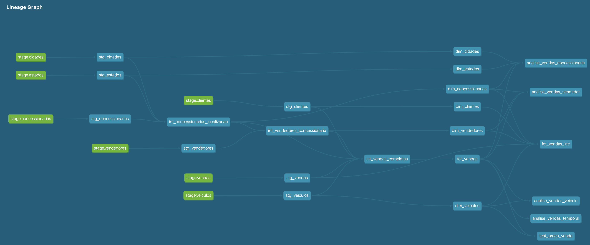
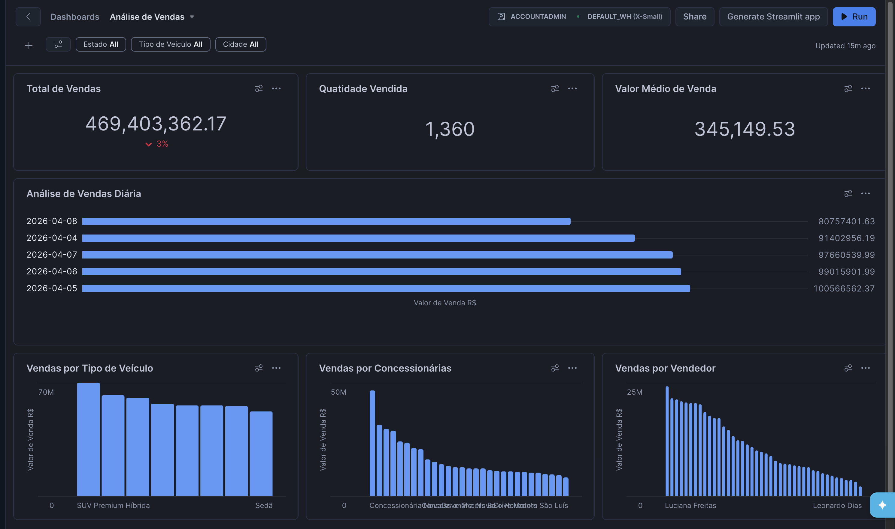
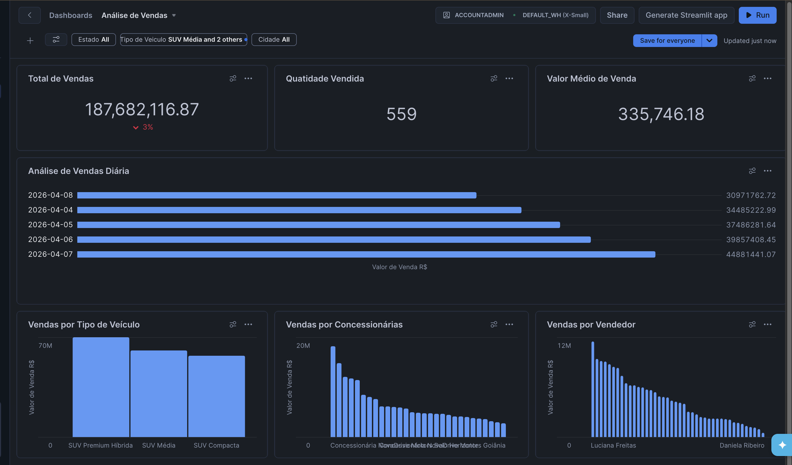
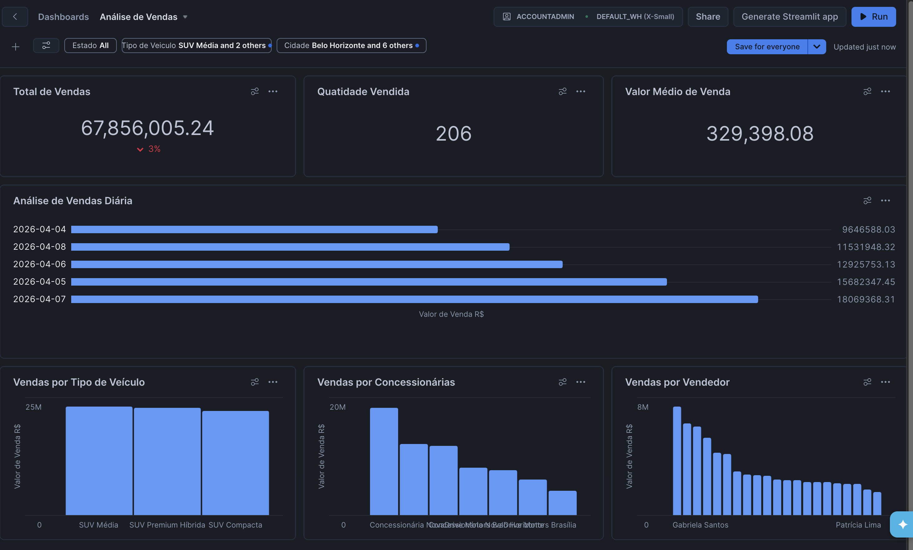
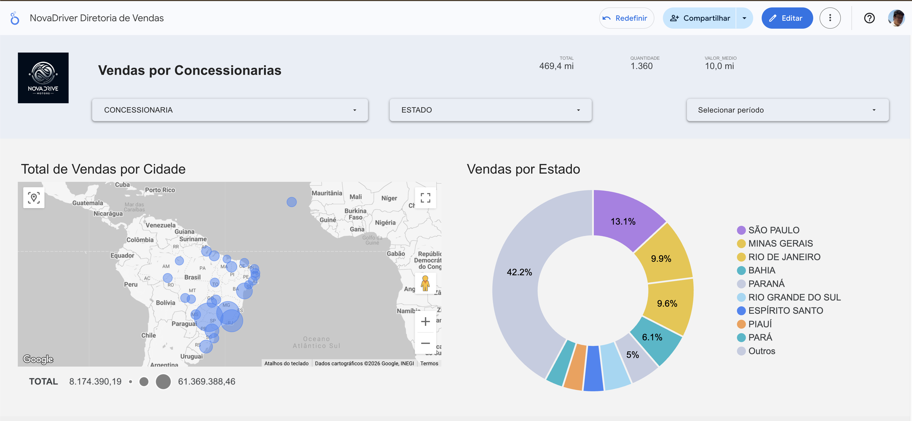
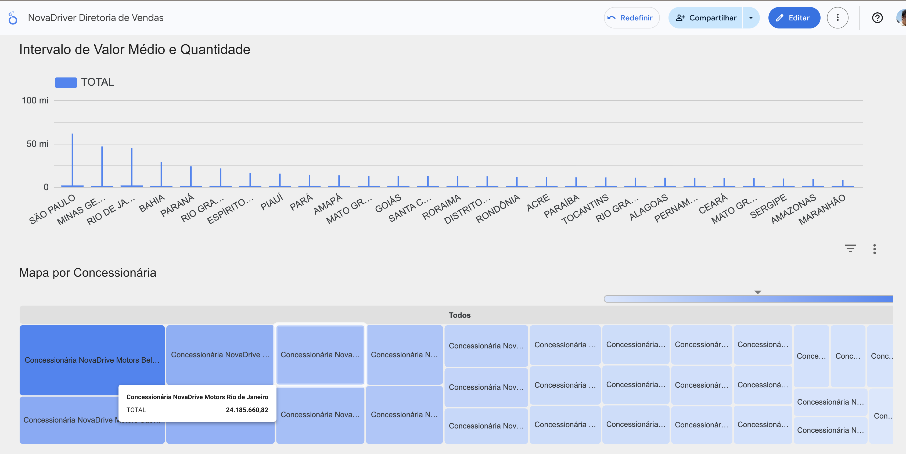

# NovaDriver
# NovaDrive Data Platform – Project Summary

The data platform for NovaDrive Motors was designed to support a modern, scalable analytics environment aligned with the company’s innovation-driven automotive business. NovaDrive operates globally, focusing on advanced vehicle technologies, including autonomous systems and predictive maintenance powered by AI. ([novadrivemotors.com.br][1])

To enable data-driven decision-making across operations, sales, and engineering, a robust **end-to-end data architecture** was implemented using modern data stack components.

---
## Architecture Overview
### 1. OLTP Layer – PostgreSQL
* **Technology:** PostgreSQL
* **Purpose:**
  * Acts as the **transactional (OLTP) system**
  * Stores operational data such as:
    * Sales transactions
    * Customers
    * Vehicles
    * Dealership operations

Note: This is the **source of truth** for real-time business operations.

[Exploratory activities on the source data](PosGres/atividades.md)

---
### 2. Orchestration Layer – Apache Airflow
* **Technology:** Apache Airflow
* **Purpose:**
  * Orchestrates data pipelines
  * Extracts **incremental data** from PostgreSQL
  * Loads raw data into Snowflake

#### Key Features:
* Incremental loading using `MAX(ID)` logic
* Pipeline scheduling and monitoring
* Retry and failure handling

Note: Airflow ensures **reliable and automated data ingestion**.

[Step-by-Step Guide to Installing Airflow - Portuguese Brazil](Airflow/airflow.md)

[More robust DAGs.md](Airflow/robust_dags.md)

---
### 3. Data Warehouse – Snowflake (RAW Layer)
* **Technology:** Snowflake
* **Purpose:**
  * Centralized **cloud data warehouse**
  * Stores **RAW (ingested) data** from PostgreSQL

#### Characteristics:
* Scalable and high-performance
* Separation of compute and storage
* Supports batch ingestion (e.g., `COPY INTO`, `write_pandas`)

Note: This layer acts as the **foundation for analytics**.

[Finding your credentials - Brazilian Portuguese](Snowflake/EncontrarCredencias.md)

[Create the NovaDrive Data Base and Schemas](Snowflake/CreateNovaDriveDataBaseAndSchemas.sql)

[Snoflake SQL create notes](Snowflake/snoflake_sql_create.md)

---
### 4. Transformation Layer – dbt (Medallion Architecture)
* **Technology:** dbt (data build tool)
* **Purpose:**
  * Transforms RAW data into analytics-ready datasets
  * Implements the **Medallion Architecture**:

#### Bronze Layer
* Raw data from Snowflake
* Minimal transformation
* Mirrors source system

#### Silver Layer
* Cleaned and standardized data
* Business rules applied
* Data quality improvements

#### Gold Layer
* Aggregated, business-ready datasets
* KPIs and metrics
* Optimized for reporting

#### dbt
**Provides**:
* Data lineage
* Version control
* Testing and documentation


[Linke to the dbt html documentation of the project](dbt/reports/index.html)

---
### 5. Visualization Layer – Snowflake Dashboard and Looker Studio
* **Purpose:**
  * Business intelligence and reporting
  * Dashboard creation for stakeholders

#### Use Cases:
* Sales performance dashboards
* Customer analytics
* Operational KPIs
* Executive reporting

Note: Enables **self-service analytics and decision-making**.

#### Snowflake Dashboards 

---

---

---
#### Looker Studio Dashboard



---
## End-to-End Data Flow

```
PostgreSQL (OLTP)
        ↓
Airflow (Orchestration & Incremental Load)
        ↓
Snowflake (RAW / Bronze)
        ↓
dbt (Silver & Gold Transformations)
        ↓
Looker Studio & Snowfalke Dashboards (Dashboards & BI)
```

---
## Key Benefits
### Scalability
* Cloud-native architecture with Snowflake

### Reliability
* Airflow-managed pipelines with incremental loads

### Data Quality
* dbt testing and transformation layers

### Governance & Lineage
* Full traceability from source → dashboard

### Business Impact
* Faster insights for:
  * Sales strategy
  * Vehicle performance
  * Customer behavior

---
## Final Positioning

This architecture positions NovaDrive as a **data-driven automotive company**, leveraging modern data engineering practices to support innovation, global operations, and advanced analytics.

---

[1]: https://www.novadrivemotors.com.br/?utm_source=chatgpt.com "NovaDrive Motors"

