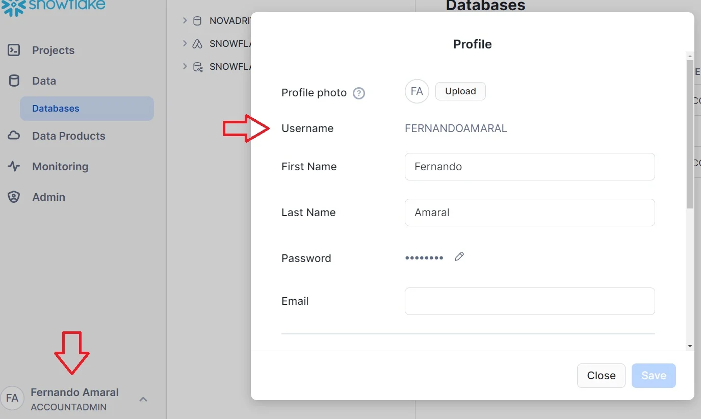

# Guia de Como Encontrar as Credencias do Snowflake
Durante o curso você vai precisar por diversas vezes das credenciais do Snowflake. Diferente de outros bancos de dados,
 as credencias são um pouco diferentes. Veja este passo a passo:
* password: você vai cadastrar a senha que desejar, anote
* database: NOVADRIVE     (vai ser sempre o mesmo)
* warehouse: DEFAULT_WH     (vai ser sempre o mesmo)
* schema: STAGE    (vai ser sempre o mesmo)
* account: busque na url do snowflake após criar a conta, substitua a / por -.

Por exemplo: 

https://app.snowflake.com/ktnlqur/va81917/#/data/databases

será ktnlqur-va81917

**obs**: na útlima seção vamos conectar o Looker Studio ao Snowflake, neste caso você deve completar account com a url, conforme exemplo abaixo:

ktnlqur-va81917.snowflakecomputing.com

*user*: clique nos dados da conta na parte inferior a esquerda, selecione profile, user estará em Username

